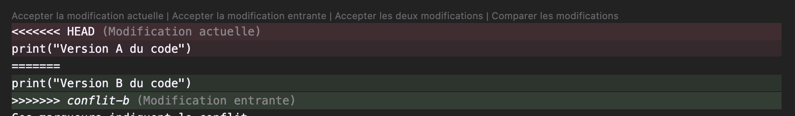
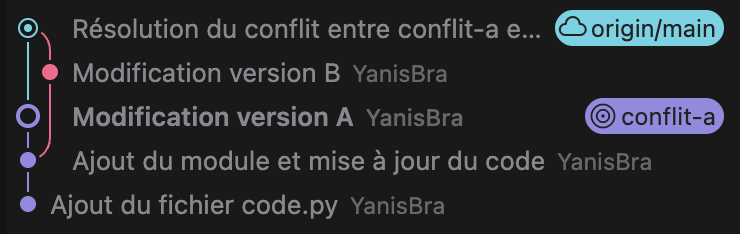

# TP2 – Création et résolution d’un conflit de merge avec Git

Ce dépôt contient la réalisation du TP2, dont l’objectif était de créer volontairement un conflit Git, de l’observer puis de le résoudre.

---

## 🧩 Étapes réalisées

### 1. Vérification de l’état du dépôt
- `git status` pour vérifier qu’il n’y avait aucune modification en attente.
- Sauvegarde ou mise de côté si nécessaire via :
  - `git add .` / `git commit -m "Sauvegarde avant conflit"`
  - ou `git stash`

---

### 2. Création de la branche **conflit-a**
- `git checkout -b conflit-a`
- Modification du fichier `code.py` pour ajouter :

```python
print("Version A du code")
```

- Commit :
  - `git add code.py`
  - `git commit -m "Modification version A"`

---

### 3. Retour sur la branche **main**
- `git checkout main`

---

### 4. Création de la branche **conflit-b**
- `git checkout -b conflit-b`
- Nouvelle modification du même fichier `code.py` :

```python
print("Version B du code")
```

- Commit :
  - `git add code.py`
  - `git commit -m "Modification version B"`

---

### 5. Fusion de *conflit-a* dans **main**
- `git checkout main`
- `git merge conflit-a`

➡️ Aucune erreur, fusion automatique réussie.

---

### 6. Fusion de *conflit-b* dans **main** (conflit volontaire)
- `git merge conflit-b`

Un conflit est détecté :

```
CONFLICT (content): Merge conflict in code.py
Automatic merge failed; fix conflicts and then commit the result.
```

📸 *Capture d’écran ajoutée montrant le conflit Git.*

---

### 7. Observation du conflit dans `code.py`

Git a inséré les marqueurs suivants : 

## Capture du conflit Git


---

### 8. Résolution du conflit
Modification du fichier pour obtenir une version finale choisie :

```python
print("Version finale du code après résolution du conflit")
```

Validation de la résolution :

```
git add code.py
git commit -m "Résolution du conflit entre conflit-a et conflit-b"
git push origin main
```

## 📸 Capture du conflit après le dernier merge


---

## ✔️ Résultat final
Le conflit a été :
- provoqué intentionnellement,
- détecté par Git,
- résolu manuellement,
- puis validé via un commit.

Le dépôt est désormais propre et à jour sur la branche **main**.
